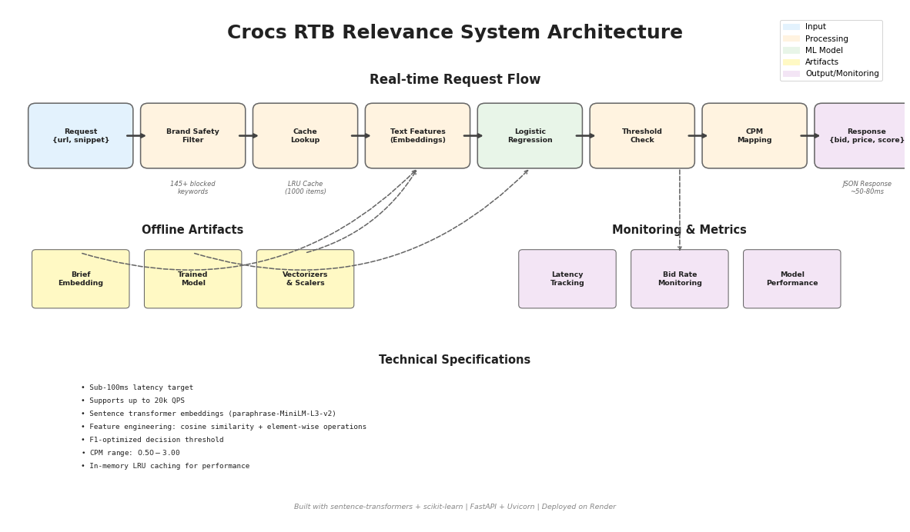

# Crocs RTB Relevance System

A real-time bidding (RTB) relevance system for Crocs campaigns. The system analyzes URL snippets against Crocs creative briefs to make bid/no-bid decisions with relevance-based CPM pricing.

## Architecture



## Features

- Sub-100ms latency
- Supports up to 20k QPS
- Sentence transformer-based relevance scoring
- FastAPI REST API endpoint

## Quick Start

### 1. Install Dependencies

```bash
pip install -r requirements.txt
```

### 2. Train and Evaluate Model

```bash
python src/eval.py
```

This will train the relevance model and output evaluation results to `results.json`.

### 3. Start FastAPI Server

```bash
python src/serve.py
```

Or using uvicorn directly:

```bash
uvicorn src.serve:app --host 0.0.0.0 --port 8000
```

The API will be available at `http://localhost:8000` with a POST endpoint at `/score`.

### 4. View Model Evaluation Report

Run the Jupyter notebook to see detailed model comparison charts:

```bash
jupyter notebook report.ipynb
```

The notebook generates ROC curves, PR curves, and performance comparison charts saved to `artifacts/`.

## Project Structure

```
.
├── src/
│   ├── model.py          # RelevanceModel class
│   ├── baseline.py       # Baseline cosine similarity model
│   ├── eval.py           # Training and evaluation script
│   └── serve.py          # FastAPI application
├── data/                 # Training and test datasets
├── artifacts/            # Trained models and generated charts
├── tools/                # Utility scripts (diagram generation)
├── requirements.txt      # Python dependencies
├── report.ipynb          # Model evaluation notebook with charts
├── diagram.png          # System architecture diagram
├── Makefile             # Build automation
├── render.yaml          # Render deployment config
├── results.json         # Model evaluation results (generated)
└── README.md            # This file
```

## Retrain after encoder change

If you've changed the encoder in `src/model.py`, retrain the model:

```bash
make setup
make retrain
```

Expected outputs:
- `artifacts/` recreated with a fresh model (e.g., model.pkl)
- Console prints test metrics and results summary
- `results.json` regenerated at repo root

## API Usage

```bash
curl -X POST "http://localhost:8000/score" \
     -H "Content-Type: application/json" \
     -d '{"url": "https://example.com", "snippet": "comfortable shoes for outdoor activities"}'
```
